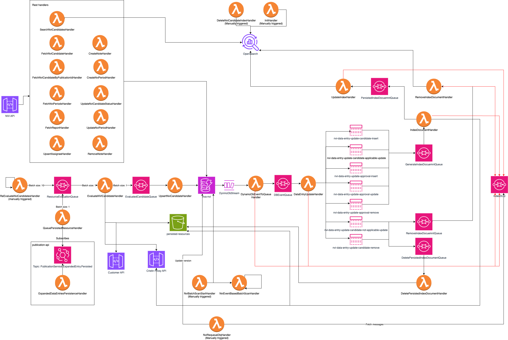

# nva-nvi

[](https://github.com/BIBSYSDEV/nva-nvi/actions/workflows/build.yml)
[](https://app.codacy.com/gh/BIBSYSDEV/nva-nvi/dashboard?utm_source=gh&utm_medium=referral&utm_content=&utm_campaign=Badge_grade)
[](https://app.codacy.com/gh/BIBSYSDEV/nva-nvi/dashboard?utm_source=gh&utm_medium=referral&utm_content=&utm_campaign=Badge_coverage)

## Introduction

`nva-nvi` is designed to manage and process publication data for nvi (Norsk vitenskapsindeks) reporting.
The project enables evaluation, point calculation and curator management of publications that qualify as nvi candidates.

[SWAGGER UI](https://petstore.swagger.io/?url=https://raw.githubusercontent.com/BIBSYSDEV/nva-nvi/refs/heads/main/docs/openapi.yaml)

## Overview



## Add a resource to your application

The application template uses AWS Serverless Application Model (AWS SAM) to define application resources. AWS SAM is an
extension of AWS CloudFormation with a simpler syntax for configuring common serverless application resources such as
functions, triggers, and APIs. For resources not included
in [the SAM specification](https://github.com/awslabs/serverless-application-model/blob/master/versions/2016-10-31.md),
you can use
standard [AWS CloudFormation](https://docs.aws.amazon.com/AWSCloudFormation/latest/UserGuide/aws-template-resource-type-ref.html)
resource types.

## When building a new environment

### Create OpenSearch Indexes

When building a new environment or the search indexes are deleted and needs to
be rebuilt, make sure to run the `InitHandler`.

## How to re-index

1. Trigger `DeleteNviCandidateIndexHandler` (skip if mappings unchanged)
2. Trigger `InitHandler` (skip if mappings unchanged)
3. Run batch job with `REFRESH_CANDIDATES` - see [batch jobs docs](docs/batch-jobs.md)

## How to start re-evaluation scan

To start a batch re-evaluation of existing publications for a given year as NVI candidates, trigger `BatchReEvaluateNviCandidatesHandler` with the following input:

```json
{
  "detail": {
    "pageSize": 500,
    "year": "2024"
  }
}
```

## Error handling

### How to requeue candidates in IndexDLQ

The `IndexDLQ` is a shared DLQ for all handlers related to indexing.
`NviRequeueDlqHandler` consumes messages from the `IndexDLQ`, and updates the
candidate in the DB with a new version. This will trigger the indexing flow
for the candidates.

Default `count` (number of messages consumed from DLQ) is 10. To specify
another `count`, provide it as input:

```json
{
  "count": 100
}
```

### DLQ Redrives

See template for which DLQs are available for redrive (configured with
`RedrivePolicy`). To start a DLQ redrive, locate the DLQ in the AWS console
(SQS) and press _Start DLQ Redrive_.

## Restoring the DynamoDB table from a backup

Restore into a new table with a distinct name and let the stack adopt it via CloudFormation auto-import. This preserves the original (possibly corrupted) table for analysis. The `NvaNviTable` resource already has `DeletionPolicy: Retain` and `UpdateReplacePolicy: Retain`, which are prerequisites for auto-import.

1. In the DynamoDB console, restore the backup into a new table, e.g. `nva-nvi-<stack>-restored-YYYYMMDD`. Do not attach it to any stack.
2. Redeploy the stack with `NviTableName=<restored-name>` **and** auto-import enabled (instructions below).
3. Run drift detection on the stack to confirm the adopted table matches the template.
4. When analysis on the old table are done, delete it manually since it is no longer managed by any stack.

### Via the AWS Console

1. CloudFormation → select the stack → _Stack actions → Create change set for current stack_.
2. Keep the existing template, click _Next_.
3. Set the `NviTableName` parameter to the restored table's name. Leave others unchanged.
4. On the options page, enable **Import existing resources**. If the checkbox is not present, use the CLI flow instead.
5. Review, create, and execute the change set.

### Via the AWS CLI

```bash
aws cloudformation create-change-set \
  --stack-name <stack> \
  --change-set-name restore-adopt \
  --change-set-type UPDATE \
  --use-previous-template \
  --parameters ParameterKey=NviTableName,ParameterValue=<restored-name> \
  --import-existing-resources \
  --capabilities CAPABILITY_IAM

aws cloudformation execute-change-set \
  --stack-name <stack> \
  --change-set-name restore-adopt
```

Pass the full template via `--template-body file://template.yaml` instead of `--use-previous-template` if the deployed template predates the `NviTableName` parameter. Inspect the change set with `describe-change-set` before executing it.

### Interaction with the deploy pipeline

The regular CodePipeline deploy (configured in `nva-common-resources` via `continuous_build_pipeline.yml`) uses the CloudFormation `CREATE_UPDATE` action with a fixed `DeployParameterOverrides` JSON that does not include `NviTableName`. CloudFormation therefore reuses the previously-deployed value of `NviTableName` on subsequent pipeline runs, so the value set during a manual import is preserved automatically — no pipeline or template-config change is needed. Pause the pipeline (or hold merges to `main`) while the restore is in progress to avoid a deploy racing with the import.
