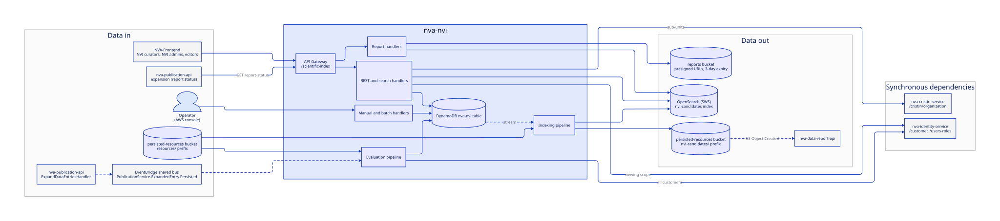

# nva-nvi architecture

Data-flow documentation for new developers on nva-nvi.
The goal is to answer three questions: how the Lambda functions connect, where data enters the service, and where it leaves.

The diagrams are [D2](https://d2lang.com/) sources in [`d2/`](d2/), rendered to the committed SVGs in [`diagrams/`](diagrams/) by [`render.sh`](render.sh).
The sources share [`d2/styles.d2`](d2/styles.d2) (classes, ELK layout, dark mode) and [`d2/models.d2`](d2/models.d2) (the nodes that recur across diagrams); to change a diagram, edit its source, run the script, and commit both.
Solid arrows are synchronous calls (HTTP or AWS SDK), dashed arrows are asynchronous hops (EventBridge, SQS, SNS, DynamoDB streams, S3 notifications).
The platform-wide view (how nva-nvi fits among the other NVA services) lives in [nva-api-documentation](https://github.com/BIBSYSDEV/nva-api-documentation/tree/main/system); this folder zooms in on the inside of this one service.
Facts were verified against `template.yaml` at the repo root, `docs/openapi.yaml`, and the code on `main` in September 2026.

## Pages

| Page | Question it answers |
| --- | --- |
| This page | What is the boundary of nva-nvi, which Lambda exists, and what does each one read and write |
| [Evaluation](evaluation.md) | How a publication becomes (or stops being) an NVI candidate |
| [Indexing](indexing.md) | How a change in the candidate table ends up in the OpenSearch worklist index |
| [Curation API](curation-api.md) | What curators and administrators do over REST, and how access is controlled |
| [Reports](reports.md) | How institution reports are produced and downloaded |
| [Batch jobs](../batch-jobs.md) | Operational refresh and migration jobs over the candidate table |

## System boundary

Everything that crosses the boundary of the service, in one picture.

The frontend downloads generated reports straight from the reports bucket through presigned URLs, and CloudWatch alarms on the dead-letter queues post to Slack; both are listed in the tables below rather than drawn.

### Where data enters

| Entry point | Mechanism | Handled by | Notes |
| --- | --- | --- | --- |
| Publication created, updated, or deleted in NVA | EventBridge rule on the shared bus for topic `PublicationService.ExpandedEntry.Persisted` | `QueuePersistedResourceHandler` | The event carries an S3 URI; only URIs under `resources/` are kept, tickets and other entry types are dropped |
| Expanded publication document | S3 read from the shared persisted-resources bucket (`EXPANDED_RESOURCES_BUCKET`) | `EvaluateNviCandidateHandler`, `IndexDocumentHandler`, `ProcessBatchJobHandler` (migrations) | nva-nvi never calls nva-publication-api over HTTP; the S3 document is the only source of publication data |
| Curator and administrator actions | REST API on `/scientific-index` | `nvi-rest` and `index-handlers/apigateway` handlers | See [Curation API](curation-api.md) |
| Report status lookups | `GET /publication/{identifier}/report-status`, unauthenticated | `FetchReportStatusByPublicationIdHandler` | Called by nva-publication-api during expansion (the `scientificIndex` field in the search index) and by the frontend landing page |
| Operator actions | Manual Lambda invocations from the AWS console | `InitHandler`, `DeleteNviCandidateIndexHandler`, `NviRequeueDlqHandler`, `BatchReEvaluateNviCandidatesHandler`, `StartBatchJobHandler` | See [Batch jobs](../batch-jobs.md) and the [repo README](../../README.md) |

### Where data leaves

| Exit point | Mechanism | Written by | Consumer |
| --- | --- | --- | --- |
| `nvi-candidates` OpenSearch index | OpenSearch Java client against SWS, Cognito client credentials from the `SearchInfrastructureCredentials` secret | `UpdateIndexHandler`, `RemoveIndexDocumentHandler` | The worklist search, institution reports, and report generation in this service |
| `nvi-candidates/{candidateIdentifier}.gz` in the persisted-resources bucket | S3 put | `IndexDocumentHandler` | `UpdateIndexHandler` (via queue) and nva-data-report-api (S3 Object Created notifications feed the Analyseplattformen CSV export) |
| Report files in the reports bucket | S3 put at a presigned key | `GenerateReportHandler` | The frontend downloads through the presigned URL; objects expire after 3 days |
| Slack alerts | CloudWatch alarms on DLQ depth and Lambda errors, published to the shared Slack SNS topic | CloudFormation alarms in `template.yaml` | The team |

nva-nvi publishes no events to the shared EventBridge bus.
Its own `nvi-internal-bus` is only used for self-pagination of the re-evaluation and batch-job handlers.

### Synchronous dependencies

| Service | Endpoint | Used by | Purpose |
| --- | --- | --- | --- |
| nva-identity-service | `GET /customer` (unauthenticated) | `EvaluateNviCandidateHandler` | The list of customers with a Cristin id and the `nviInstitution` flag decides which creators count as NVI creators |
| nva-identity-service | `GET /users-roles/users/{username}` (backend client credentials) | `SearchNviCandidatesHandler`, `UpdateNviCandidateStatusHandler`, `UpsertAssigneeHandler`, `CreateNoteHandler`, `RemoveNoteHandler` | The user's viewing scope (included units), and validation that an assignee holds the curator right |
| nva-cristin-service | `GET /cristin/organization/{id}` (unauthenticated, versioned media type) | The same handlers, through `ViewingScopeValidatorImpl` | Expands each viewing-scope unit to its sub-units (`hasPart`) |
| nva-publication-channels-java | channel lookups through `PublicationChannelRetriever` | `libs/migration-service` only, run by `ProcessBatchJobHandler` | Marked for removal in NP-51402 once data is migrated; not part of normal evaluation |

## Lambda inventory

Every function in `template.yaml` on `main`, grouped by pipeline.
The template logical name is used; the Java class name is the same unless noted.

### Evaluation (module `event-handlers`)

| Function | Triggered by | Reads | Writes |
| --- | --- | --- | --- |
| `QueuePersistedResourceHandler` | EventBridge rule, shared bus, topic `PublicationService.ExpandedEntry.Persisted` | Event payload only | SQS `ResourceEvaluationQueue` |
| `EvaluateNVICandidateHandler` (class `EvaluateNviCandidateHandler`) | SQS `ResourceEvaluationQueue`, batch size 1 | S3 expanded publication, identity-service customers, DynamoDB (existing candidate and periods) | DynamoDB candidate, approvals, points |
| `BatchReEvaluateNviCandidatesHandler` (class `ReEvaluateNviCandidatesHandler`) | Manual, and EventBridge rule on `nvi-internal-bus` for topic `NviService.ReEvaluate` | DynamoDB `SearchByYear` index | SQS `ResourceEvaluationQueue`, next-page event on the internal bus |

### Indexing (modules `event-handlers` and `index-handlers`)

| Function | Triggered by | Reads | Writes |
| --- | --- | --- | --- |
| `DynamoDbEventToQueueHandler` | DynamoDB stream of the nva-nvi table, batch size 1 | Stream record | SQS `DbEventQueue` |
| `DataEntryUpdateHandler` | SQS `DbEventQueue` | Message | One of seven SNS topics `nvi-data-entry-update-*` |
| `IndexDocumentHandler` | SQS `GenerateIndexDocumentQueue` | DynamoDB candidate, S3 expanded publication | S3 `nvi-candidates/{id}.gz`, SQS `PersistedIndexDocumentQueue` |
| `UpdateIndexHandler` | SQS `PersistedIndexDocumentQueue` | S3 index document | OpenSearch `nvi-candidates` |
| `RemoveIndexDocumentHandler` | SQS `RemoveDocumentFromIndexQueue` | Message | OpenSearch delete by candidate id |
| `DeletePersistedIndexDocumentHandler` | SQS `DeletePersistedIndexDocumentQueue` | Message | S3 delete of `nvi-candidates/{id}.gz` |

### REST API (modules `nvi-rest` and `index-handlers`)

| Function | Route | Reads | Writes |
| --- | --- | --- | --- |
| `SearchNviCandidatesHandler` | `GET /candidate` | OpenSearch, identity-service, cristin-service | none |
| `FetchNviCandidateHandler` | `GET /candidate/{candidateIdentifier}` | DynamoDB | none |
| `FetchNviCandidateByPublicationIdHandler` | `GET /candidate/publication/{identifier}` | DynamoDB | none |
| `FetchReportStatusByPublicationIdHandler` | `GET /publication/{identifier}/report-status` | DynamoDB | none |
| `UpdateNviCandidateStatusHandler` | `PUT /candidate/{candidateIdentifier}/status` | DynamoDB, identity-service, cristin-service | DynamoDB approval |
| `UpsertAssigneeHandler` | `PUT /candidate/{candidateIdentifier}/assignee` | DynamoDB, identity-service, cristin-service | DynamoDB approval |
| `CreateNoteHandler` | `POST /candidate/{candidateIdentifier}/note` | DynamoDB, identity-service, cristin-service | DynamoDB note |
| `RemoveNoteHandler` | `DELETE /candidate/{candidateIdentifier}/note/{noteIdentifier}` | DynamoDB, identity-service, cristin-service | DynamoDB note |
| `CreateNviPeriodHandler`, `UpdateNviPeriodHandler` | `POST /period`, `PUT /period` | DynamoDB | DynamoDB period |
| `FetchNviPeriodsHandler`, `FetchNviPeriodHandler` | `GET /period`, `GET /period/{periodIdentifier}` | DynamoDB | none |
| `FetchNviCandidateContextHandler` | `GET /context` | Static JSON-LD context | none |
| `FetchInstitutionStatusAggregationHandler` | `GET /institution-report/{year}` | OpenSearch aggregation | none |
| `FetchInstitutionReportHandler` | `GET /institution-approval-report/{year}` | OpenSearch, paged | none (returns XLSX inline) |
| `FetchReportHandler` | `GET /reports`, `/reports/{period}`, `/reports/{period}/institutions`, `/reports/{period}/institutions/{institution}` | DynamoDB periods, OpenSearch aggregations | SQS `ReportQueue` for CSV and XLSX requests |

### Reports and operations

| Function | Triggered by | Reads | Writes |
| --- | --- | --- | --- |
| `GenerateReportHandler` (`index-handlers`) | SQS `ReportQueue`, batch size 1, 15 minute timeout | DynamoDB periods, OpenSearch (scroll or aggregations) | Reports bucket |
| `StartBatchJobHandler` (`event-handlers`) | Manual, and EventBridge rule on `nvi-internal-bus` for detail-type `NviService.BatchJob.StartBatchJob` | DynamoDB scan or `SearchByYear` index | SQS `BatchJobWorkQueue`, next-page event on the internal bus |
| `ProcessBatchJobHandler` (`event-handlers`) | SQS `BatchJobWorkQueue`, batch size 10, max concurrency 4 | DynamoDB, S3 expanded publication (migrations) | DynamoDB candidates and periods |
| `NviRequeueDlqHandler` (class `RequeueDlqHandler`, `event-handlers`) | Manual | SQS `IndexDLQ` | DynamoDB (bumps candidate version to re-trigger indexing) |
| `InitHandler`, `DeleteNviCandidateIndexHandler` (class `DeleteNviIndexHandler`, `index-handlers`) | Manual | none | OpenSearch index create or delete |

## Storage

- **DynamoDB `nva-nvi-{stack}`**: single-table design with candidates, approvals (one per contributing top-level institution), notes, periods, and a uniqueness entry per publication.
  Two global secondary indexes: `SearchByPublicationId` and `SearchByYear`.
  The stream (`NEW_AND_OLD_IMAGES`) is the sole trigger of the indexing pipeline, so any write to a candidate or approval row eventually re-indexes that candidate.
  Point-in-time recovery is enabled and the table is tagged for the platform backup plan.
- **Persisted-resources bucket** (shared, owned by the platform, name from SSM `/NVA/Events/PersistedEntriesBucketName`): nva-nvi reads `resources/` and owns `nvi-candidates/`.
- **Reports bucket** (`reports-{account}`): generated CSV and XLSX files, deleted after 3 days, CORS for the API and frontend domains.
- **OpenSearch index `nvi-candidates`** on the shared SWS cluster: the read model for the worklist and all reports.

## Failure handling

Every asynchronous hop has its own dead-letter queue, and the ones that matter in daily operations have a Slack alarm.

| Step | Dead-letter queue | Slack alarm | Recovery |
| --- | --- | --- | --- |
| `QueuePersistedResourceHandler` invoke failure | `QueuePersistedResourceDLQ` | no | Redrive from the console |
| Evaluation (`ResourceEvaluationQueue`, 5 receives) | `EvaluationDLQ` | yes | Redrive from the console; the message is an S3 URI, so re-evaluation is idempotent |
| Re-evaluation handler | `ReEvaluateDLQ` | no | Re-invoke with the same year and start marker |
| DynamoDB stream to queue | `DynamoDbEventToQueueDLQ` (metadata only, after 10 retries or 6 hours) | yes | Refresh the candidate named in the error log with a `REFRESH_CANDIDATES` batch job |
| `DbEventQueue` (5 receives) | `DataEntryUpdateDLQ` | yes | Redrive |
| `GenerateIndexDocumentQueue` (5 receives) | `IndexDocumentDLQ` | yes | Redrive |
| `PersistedIndexDocumentQueue` (5 receives) | `UpdateIndexDLQ` | yes | Redrive |
| `RemoveDocumentFromIndexQueue`, `DeletePersistedIndexDocumentQueue` (5 receives) | `RemoveDocumentFromIndexDLQ`, `DeletePersistedIndexDocumentDLQ` | no | Redrive |
| Any indexing handler that fails on a specific candidate | `IndexDLQ` (written explicitly by the handlers) | yes | `NviRequeueDlqHandler` reads the messages and bumps the candidate version in DynamoDB, which restarts the indexing pipeline |
| Batch jobs (`BatchJobWorkQueue`, 3 receives) | `BatchJobDLQ` | yes, plus an alarm on `StartBatchJobHandler` errors | Redrive |
| Report generation (`ReportQueue`, 3 receives) | `ReportQueueDLQ` | yes | The presigned URL has expired by then; the user requests the report again |

## Modules

| Module | Contents |
| --- | --- |
| `event-handlers` | Evaluation, stream fan-out, re-evaluation, batch jobs, DLQ requeue |
| `index-handlers` | Index document generation, OpenSearch writes, search and report REST handlers |
| `nvi-rest` | Candidate, approval, note, and period REST handlers |
| `nvi-commons` | Domain model, DynamoDB repositories and services, queue and notification clients, HTTP clients |
| `nvi-report` | CSV and XLSX generators and the S3 presigner |
| `libs/publication-service` | Loads an expanded publication from S3 and projects it to the NVI domain model with SPARQL (see [Evaluation](evaluation.md)) |
| `libs/rdf` | Jena helpers: graph building, SHACL validation, SPARQL construct pipeline, JSON-LD framing |
| `libs/viewing-scope` | Viewing scope validation against identity-service and cristin-service |
| `libs/migration-service` | One-off data migrations run through the batch job system |
| `nvi-test`, `integration-tests` | Shared test fixtures and integration tests |

## Retired flows

The old overview image `resources/NVI-overview.png` (removed together with its drawio source in the change that added these pages) showed an `EvaluatedCandidateQueue` with an `UpsertNviCandidateHandler`, a `NviBatchScanStartHandler`, and a consumer of the Cristin NVI import queue.
None of these exist any more: evaluation writes straight to DynamoDB, batch scanning is done by `StartBatchJobHandler` and `ProcessBatchJobHandler`, and the historical Cristin NVI report import (`CristinNviReportEventConsumer`) was removed after the migration finished.
The `CristinImportNviQueue` still exists in nva-common-resources and nva-publication-api still knows how to write to it, but nothing consumes it.
