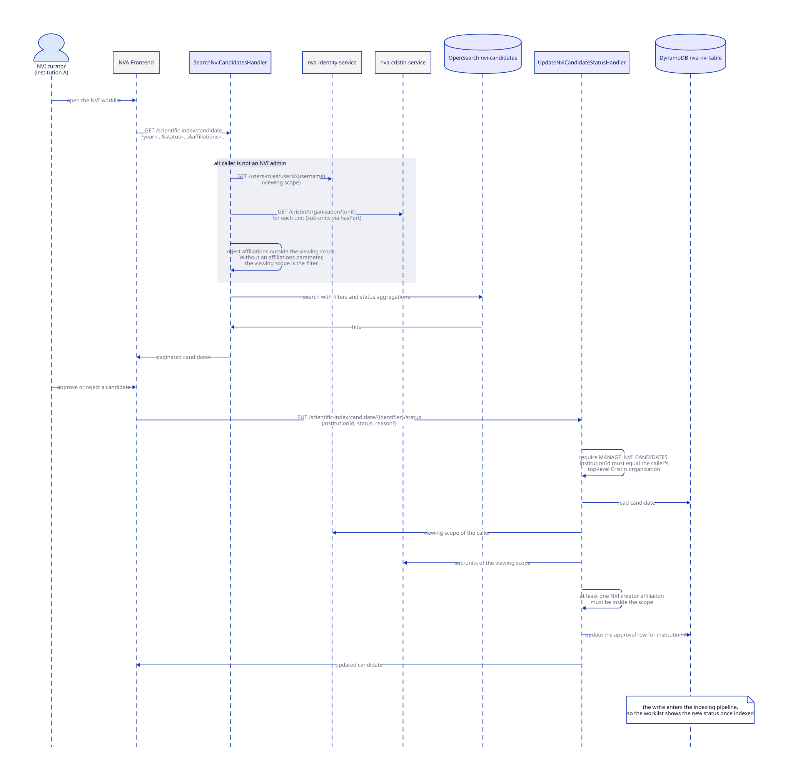

# Curation API

The REST API on `/scientific-index` is how NVI curators work through their institution's candidates and how NVI administrators manage reporting periods.
All routes are defined in `docs/openapi.yaml` and wired to Lambda functions by `template.yaml`.

## Roles

Access is decided by access rights in the Cognito token, issued by nva-identity-service.

| Role in the code | Access right | Typical user |
| --- | --- | --- |
| NVI curator | `MANAGE_NVI_CANDIDATES` | Curator at one institution, sees only candidates in their viewing scope |
| NVI admin | `MANAGE_NVI` | Application administrator, manages periods and sees everything |
| Editor | `MANAGE_RESOURCES_ALL` | Institution editor, may read reports |
| Internal backend | Cognito backend scope | Other NVA services |

Two more checks appear on mutating endpoints:

- **Same institution**: the `institutionId` in the request body must equal the caller's top-level Cristin organization from the token.
  A curator can only act on their own institution's approval.
- **Viewing scope**: the caller's viewing scope (from nva-identity-service) expanded to sub-units (from nva-cristin-service) must contain at least one affiliation of the candidate's NVI creators.

## Endpoints

| Route | Function | Data source | Who may call |
| --- | --- | --- | --- |
| `GET /candidate` (worklist search) | `SearchNviCandidatesHandler` | OpenSearch | Authenticated; non-admins are restricted to their viewing scope |
| `GET /candidate/{candidateIdentifier}` | `FetchNviCandidateHandler` | DynamoDB | NVI curator or NVI admin |
| `GET /candidate/publication/{identifier}` | `FetchNviCandidateByPublicationIdHandler` | DynamoDB | NVI curator or NVI admin |
| `PUT /candidate/{candidateIdentifier}/status` | `UpdateNviCandidateStatusHandler` | DynamoDB | NVI curator, same institution, viewing scope |
| `PUT /candidate/{candidateIdentifier}/assignee` | `UpsertAssigneeHandler` | DynamoDB | NVI curator, same institution, viewing scope; the assignee must also be an NVI curator |
| `POST /candidate/{candidateIdentifier}/note` | `CreateNoteHandler` | DynamoDB | NVI curator, viewing scope |
| `DELETE /candidate/{candidateIdentifier}/note/{noteIdentifier}` | `RemoveNoteHandler` | DynamoDB | NVI curator, viewing scope |
| `GET /period`, `POST /period`, `PUT /period` | `FetchNviPeriodsHandler`, `CreateNviPeriodHandler`, `UpdateNviPeriodHandler` | DynamoDB | NVI admin |
| `GET /period/{periodIdentifier}` | `FetchNviPeriodHandler` | DynamoDB | Public |
| `GET /publication/{identifier}/report-status` | `FetchReportStatusByPublicationIdHandler` | DynamoDB | Public |
| `GET /context` | `FetchNviCandidateContextHandler` | Static | Public |
| `GET /institution-report/{year}`, `GET /institution-approval-report/{year}`, `GET /reports/...` | See [Reports](reports.md) | OpenSearch | NVI curator, NVI admin, editor, or internal backend |

The read endpoints for a single candidate check the access right but not the viewing scope, so a curator with the right can read any candidate by identifier.
Only the search results and the mutating endpoints are scoped.

## Worklist and approval

The central curator scenario: find the institution's pending candidates, then approve or reject one.

Approvals are independent per institution.
A candidate with contributors from three NVI institutions has three approval rows, and each institution's curators only change their own.
The candidate's global status (pending, approved, rejected, or dispute) is derived from the set of approvals.

## Periods

Periods are keyed by publishing year and hold a start date and a reporting date.
`CreateNviPeriodHandler` and `UpdateNviPeriodHandler` require `MANAGE_NVI`.
While a period is open, candidates for that year can be created, re-evaluated, and approved.
After the reporting date the period is closed: the evaluator refuses to change existing candidates for that year, and the `REPORT_APPROVED_CANDIDATES` batch job marks the approved ones as reported.

## The report-status endpoint and the circular dependency

`GET /publication/{identifier}/report-status` is unauthenticated and returns the candidate's report status (`NOT_CANDIDATE`, `PENDING_REVIEW`, `UNDER_REVIEW`, `APPROVED`, `REJECTED`, `NOT_REPORTED`, `REPORTED`) plus the period.
nva-publication-api calls it during expansion and stores the answer as the `scientificIndex` field of the expanded document, which is what the general search index shows.

This makes the two services mutually dependent: nva-nvi evaluates the expanded document that nva-publication-api produced, and that document embeds the report status nva-nvi returned before the current evaluation ran.
The dependency is asynchronous and eventually consistent.
When a candidate's status changes, the general search index does not update until the publication is expanded again.
