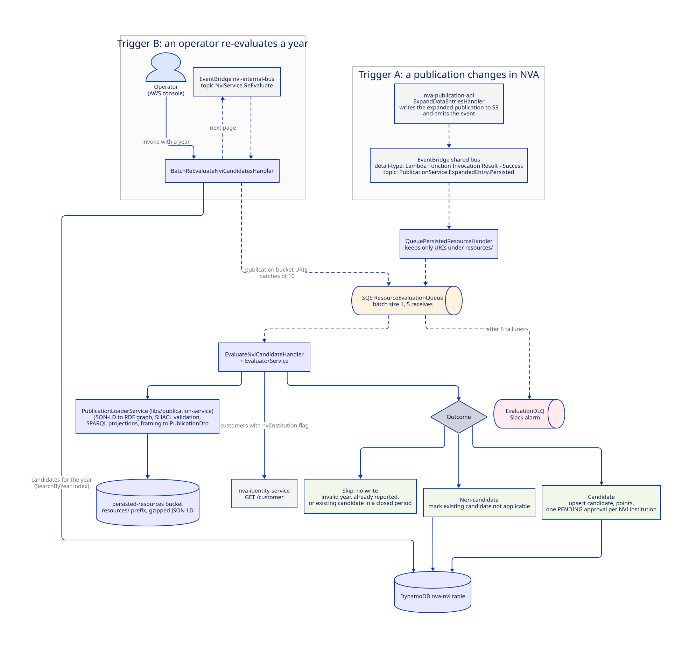
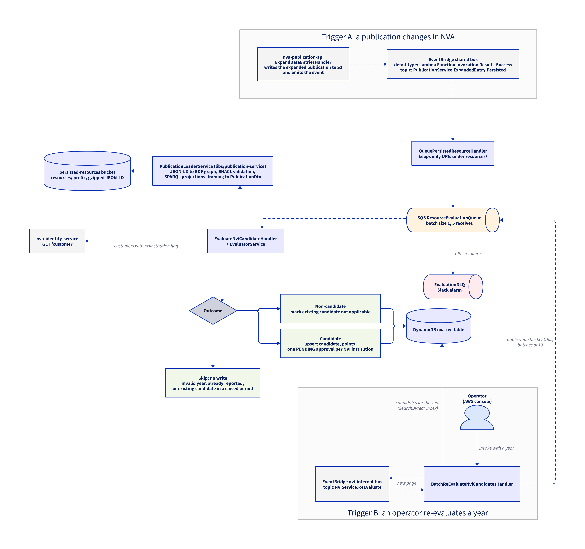

# Evaluation: publication to candidate

Every time nva-publication-api persists an expanded publication, nva-nvi decides whether that publication is an NVI candidate and stores the result.
This is the only way candidates come into existence.
Curators never create candidates by hand.

## Triggers

Evaluation starts in exactly two ways.

| Trigger                            | Who                                | What happens                                                                                                                                                                                                                                                                                           |
| ---------------------------------- | ---------------------------------- | ------------------------------------------------------------------------------------------------------------------------------------------------------------------------------------------------------------------------------------------------------------------------------------------------------ |
| A: a publication changes in NVA    | nva-publication-api, automatically | `ExpandDataEntriesHandler` writes the expanded publication to the persisted-resources bucket and emits `PublicationService.ExpandedEntry.Persisted`; nva-nvi's rule on the shared bus picks it up. This covers creates, updates, and deletes of any publication, so it runs continuously in production |
| B: an operator re-evaluates a year | A developer, from the AWS console  | Invoking `BatchReEvaluateNviCandidatesHandler` with a year queues every non-reported candidate of that year for evaluation again, using the S3 URI stored on each candidate. Used after rule changes or bug fixes in the evaluator                                                                     |

Both triggers end up on the same `ResourceEvaluationQueue`, so everything from `EvaluateNviCandidateHandler` onwards is identical.
Batch jobs (`REFRESH_CANDIDATES`, `MIGRATE_CANDIDATES`) do not re-evaluate; they rewrite existing candidates and only feed the [indexing pipeline](indexing.md).

## Flow
TODO: Fix this

Default, Elk/SVG:

Elk/PNG:

Tala/SVG:

Tala/PNG:

## Clickable links

Tala/SVG:

Tala/PNG:

## Step by step

1. nva-publication-api's `ExpandDataEntriesHandler` writes the expanded publication to the persisted-resources bucket and emits `PublicationService.ExpandedEntry.Persisted`.
   The event is the standard Lambda destination envelope, so the rule matches on `detail.responsePayload.topic`.
2. `QueuePersistedResourceHandler` takes the S3 URI from the event.
   Tickets and other entry types share the topic, so the handler keeps only URIs whose path contains `resources` and drops the rest.
   The kept URI is sent to `ResourceEvaluationQueue` as a `PersistedResourceMessage`.
3. `EvaluateNviCandidateHandler` reads one message per invocation (the code only looks at the first record, hence the batch size of 1 in the template).
4. `PublicationLoaderService` fetches the object from S3, extracts the `body` node, and builds an RDF graph with Jena.
   The graph is validated against `nva-shape.ttl`, then projected through four SPARQL construct queries into an NVI-specific graph, validated against `nvi-shape.ttl`, and framed with `publication_frame.json` into a `PublicationDto`.
   The queries live in `libs/publication-service/src/main/resources`:

   | Query                                | Purpose                                                                                                                      |
   | ------------------------------------ | ---------------------------------------------------------------------------------------------------------------------------- |
   | `nva_normalization.rq`               | Normalizes the NVA publication model                                                                                         |
   | `nvi_channel_pairing.rq`             | Picks the channel that determines the level: the journal for articles, the series if it has a level, otherwise the publisher |
   | `nvi_applicability.rq`               | Marks whether the publication type and channel level qualify                                                                 |
   | `nvi_international_collaboration.rq` | Derives the international collaboration flag used by the point calculation                                                   |

   nva-nvi does not call the channel register or nva-publication-api here.
   Channel level, contributors, and affiliations are all read from the expanded document, so a stale expanded document gives a stale evaluation.

5. `EvaluatorService` first checks whether evaluation should be skipped entirely: an unparseable publication year, a candidate that is already reported, or an existing candidate whose period is closed.
   Closed-period candidates are frozen so that reported numbers never change after the fact.
6. If the publication is not published, not an applicable type, or has no channel with level 1 or 2, the result is a non-candidate.
7. Otherwise the handler fetches all customers from nva-identity-service (unauthenticated `GET /customer`).
   Customers with a Cristin id and the `nviInstitution` flag are the NVI institutions.
   Creators whose affiliations belong to such an institution are the NVI creators; a publication without NVI creators is a non-candidate.
8. The publication year must have a period that allows evaluation.
   A publication whose period is not open is a non-candidate.
9. Points are calculated per institution and creator, and the candidate is upserted in DynamoDB with one `PENDING` approval per NVI institution.
   A non-candidate result updates an existing candidate to not applicable, or does nothing if the publication was never a candidate.

The DynamoDB write is where this flow hands over to the [indexing pipeline](indexing.md).

## Re-evaluation

`BatchReEvaluateNviCandidatesHandler` re-runs evaluation for every non-reported candidate of a given year, for example after a rule change.
It is started manually with `{"detail": {"year": "2024", "pageSize": 500}}`, pages through the `SearchByYear` index, pushes each candidate's stored publication bucket URI onto `ResourceEvaluationQueue` in batches of 10, and emits a `NviService.ReEvaluate` event with the last evaluated key on `nvi-internal-bus` to trigger the next page.
Because it reuses the stored S3 URI, it re-evaluates the last expanded document, not a fresh one.

## Failure handling

- A failed evaluation is retried up to five times by SQS and then lands on `EvaluationDLQ`, which has a Slack alarm.
  Messages are S3 URIs, so redriving them is safe.
- Failures in `QueuePersistedResourceHandler` go to `QueuePersistedResourceDLQ` (no alarm).
- Failures in the re-evaluation handler go to `ReEvaluateDLQ` (no alarm).
