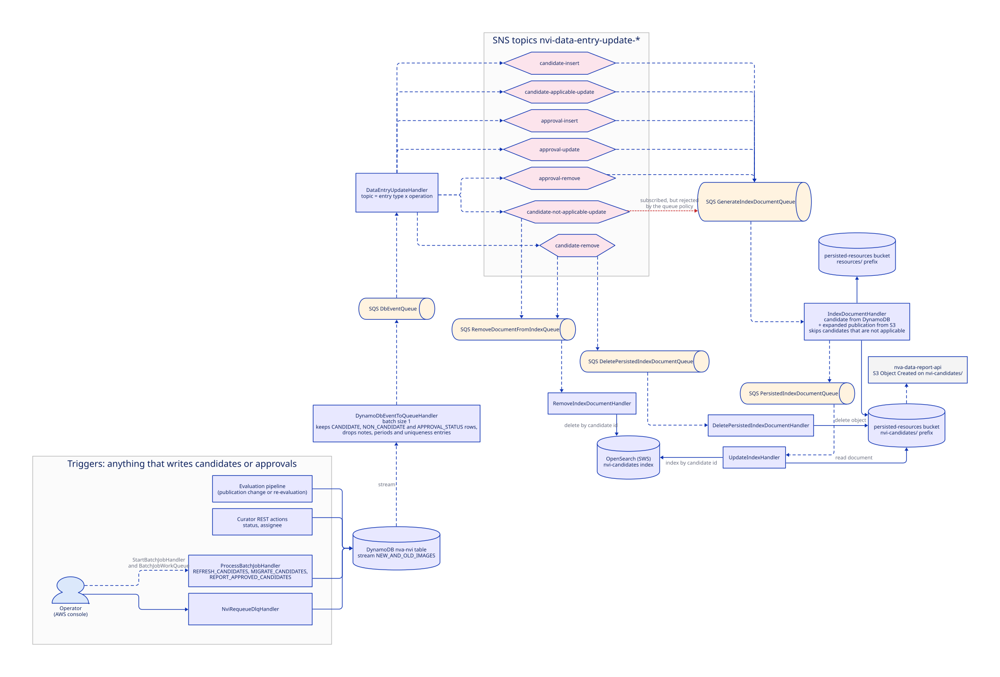
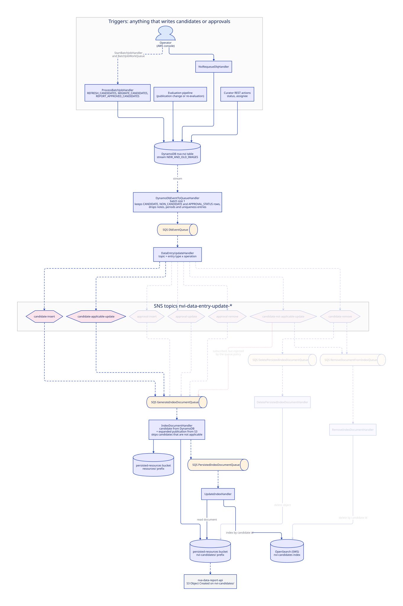
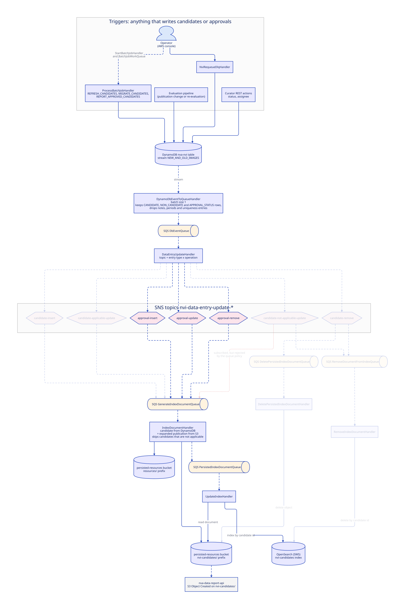
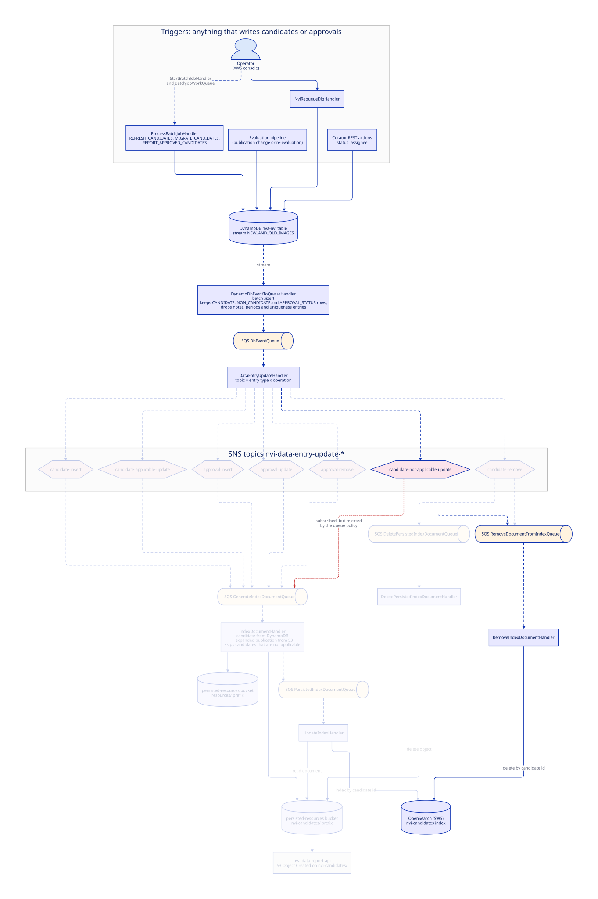
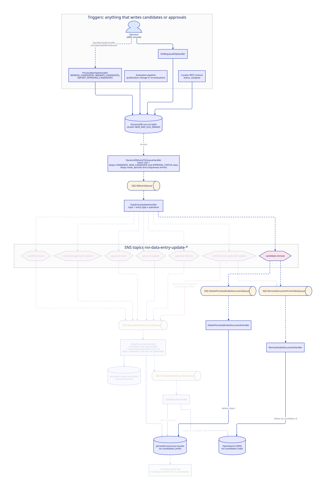

# Indexing: candidate table to OpenSearch

The DynamoDB table is the source of truth, but curators never query it directly.
The worklist, all aggregations, and all reports read the `nvi-candidates` OpenSearch index, which is a projection of the
table joined with publication data from S3.
This page shows how a change in the table reaches the index.

## Triggers

There is no direct way to start indexing.
The pipeline is triggered by the DynamoDB stream, so anything that writes a candidate or approval row starts it, and
nothing else does.

| Writer                               | Started by                                                       | Typical rows written          |
| ------------------------------------ | ---------------------------------------------------------------- | ----------------------------- |
| [Evaluation pipeline](evaluation.md) | A publication change in NVA, or an operator re-evaluating a year | Candidate and its approvals   |
| Curator REST actions                 | NVI curators in the frontend                                     | Approval (status, assignee)   |
| `ProcessBatchJobHandler`             | Batch job started by an operator via `StartBatchJobHandler`      | Candidate, rewritten in place |
| `NviRequeueDlqHandler`               | Invoked by operator to drain `IndexDLQ`                          | Candidate version bump        |

Notes and periods are also written to the table (`CreateNoteHandler`, the period handlers, `REFRESH_PERIODS`), but the
stream handler drops those rows, so they never reach the index on their own.
Because every writer goes through the same stream, "refresh the candidate" (a `REFRESH_CANDIDATES` batch job) is the
universal repair action for a stale or missing index document.

## Flow

## One write at a time

The diagram above shows every path at once.
The same D2 file also produces four scenario boards that fade everything except the path one kind of table write takes.
The layout is the same on every board, so the eye can compare them directly.
The red dashed edge is the SNS subscription that exists in the template but is blocked by the queue's access policy.

**A candidate is inserted, or updated while still applicable.**
The evaluator upserting a candidate, or a batch job rewriting one, takes this path: a new index document is generated
and indexed.

**An approval changes.**
A curator approving, rejecting, or assigning takes the same generate path as a candidate upsert, through the three
approval topics; the whole candidate document is regenerated.

**A candidate becomes not applicable.**
Only the remove path runs: the OpenSearch document is deleted, while the S3 document and the data-report feed are
untouched.
The rejected subscription would otherwise also have queued a (skipped) regeneration.

**A candidate row is removed.**
Both the remove path and the delete path run: the OpenSearch document and the S3 document are deleted.
nva-data-report-api is not notified, since it only listens for object creation.

## Step by step

1. Any write to the table produces a stream record.
   `DynamoDbEventToQueueHandler` parses the row type.
   A candidate row is typed `CANDIDATE` when its applicable flag is true and `NON_CANDIDATE` otherwise; approval rows
   are `APPROVAL_STATUS`.
   Notes, periods, and the per-publication uniqueness entry are logged and dropped, since none of them are indexed on
   their own.
   The handler forwards a compact `DynamoDbChangeMessage` (candidate identifier, entry type, operation) to
   `DbEventQueue`, never the full record.
2. `DataEntryUpdateHandler` publishes that message to one SNS topic chosen by entry type and operation:

   | Operation | `CANDIDATE`                 | `NON_CANDIDATE`                 | `APPROVAL_STATUS` |
   | --------- | --------------------------- | ------------------------------- | ----------------- |
   | INSERT    | candidate-insert            | not expected                    | approval-insert   |
   | MODIFY    | candidate-applicable-update | candidate-not-applicable-update | approval-update   |
   | REMOVE    | candidate-remove            | candidate-remove                | approval-remove   |

3. The topics fan out to three queues.
   Inserts and applicable updates of candidates, plus all approval changes, go to `GenerateIndexDocumentQueue`.
   Not-applicable updates and removals go to `RemoveDocumentFromIndexQueue`.
   Removals additionally go to `DeletePersistedIndexDocumentQueue`.
   The template also subscribes `GenerateIndexDocumentQueue` to the not-applicable topic, but that queue's access policy
   does not list the topic, so the delivery is rejected; the handler would have skipped the candidate anyway, so the
   effect is the same.
4. `IndexDocumentHandler` loads the candidate from DynamoDB and, through `PublicationLoaderService`, the expanded
   publication from S3.
   It builds an `NviCandidateIndexDocument` (candidate, approvals, points, publication details), writes it to
   `nvi-candidates/{candidateIdentifier}.gz` in the persisted-resources bucket, and sends the document URI to
   `PersistedIndexDocumentQueue`.
   Candidates that are not applicable are skipped.
   No HTTP calls are made here; everything comes from DynamoDB and S3.
5. `UpdateIndexHandler` reads the document back from S3 and indexes it into `nvi-candidates` with the candidate
   identifier as document id.
6. `RemoveIndexDocumentHandler` deletes the OpenSearch document; `DeletePersistedIndexDocumentHandler` deletes the S3
   object.
   A candidate that becomes not applicable is removed from the index but its S3 document stays until the candidate row
   is removed.

## Side effect: data reports

The `nvi-candidates/` prefix is not private to nva-nvi.
nva-data-report-api subscribes to S3 Object Created notifications on that prefix and converts each document to CSV for
Analyseplattformen.
Changing the shape of `NviCandidateIndexDocument` therefore affects the data platform, not just the worklist.

## OpenSearch access

All OpenSearch traffic goes to the shared Search Workspace Service cluster (`SEARCH_INFRASTRUCTURE_API_HOST`).
The client authenticates with OAuth2 client credentials against `SEARCH_INFRASTRUCTURE_AUTH_URI`, using the
`SearchInfrastructureCredentials` secret.
The index name comes from `NVI_SEARCH_INDEX` and is `nvi-candidates` in every environment.
The index and its mappings are created by the manually run `InitHandler`; `DeleteNviCandidateIndexHandler` drops it when
mappings change, after which a `REFRESH_CANDIDATES` batch job re-indexes everything by touching every candidate row.

## Failure handling

Two layers exist.
SQS retries and per-queue dead-letter queues (`DataEntryUpdateDLQ`, `IndexDocumentDLQ`, `UpdateIndexDLQ`,
`RemoveDocumentFromIndexDLQ`, `DeletePersistedIndexDocumentDLQ`) catch crashes.
On top of that, the handlers explicitly write messages they could not process to the shared `IndexDLQ`, tagged with the
candidate identifier.
`NviRequeueDlqHandler` drains `IndexDLQ` and updates each candidate's version in DynamoDB, which re-enters this pipeline
from step 1.

The stream trigger itself has bounded retries (10 attempts, records older than 6 hours are dropped) so a poison record
cannot block the shard forever.
Its failure destination `DynamoDbEventToQueueDLQ` receives only shard metadata, not the record, so recovery is a
`REFRESH_CANDIDATES` batch job for the candidate identifier found in the error log.
