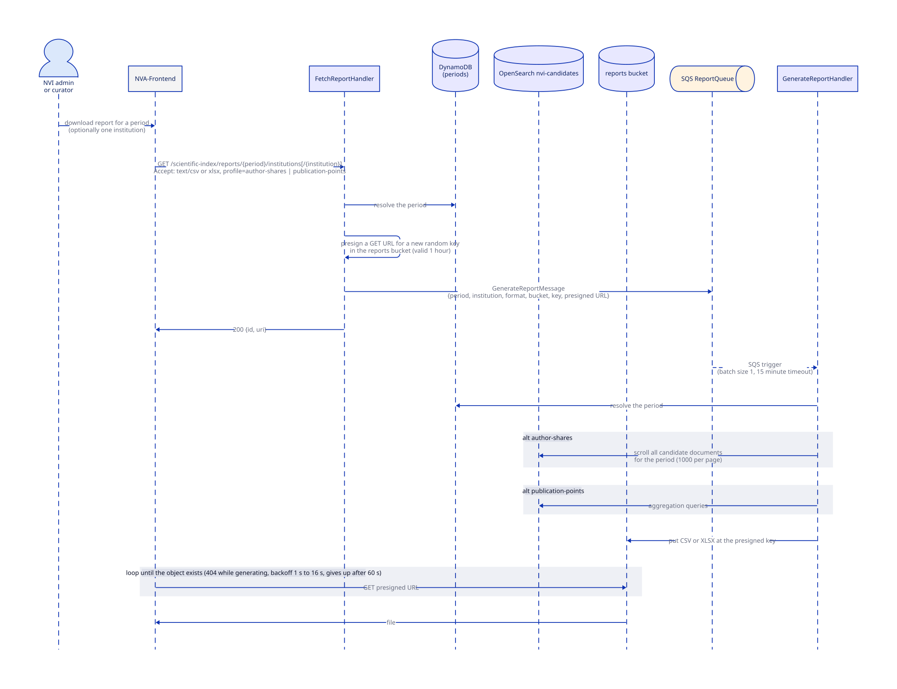

# Reports

All reports are computed from the `nvi-candidates` OpenSearch index, never from DynamoDB.
That is why the index has to be complete before a reporting deadline.
The frontend's NVI report pages call these endpoints directly; nva-data-report-api is a separate feed for the data platform and is not involved.

Access to every report endpoint requires NVI curator, NVI admin, editor, or the internal backend scope.

## Three kinds of report endpoints

| Route | Function | How it works | Output |
| --- | --- | --- | --- |
| `GET /institution-report/{year}` | `FetchInstitutionStatusAggregationHandler` | One aggregation query on approval status for the caller's top-level organization | JSON status counts |
| `GET /institution-approval-report/{year}` | `FetchInstitutionReportHandler` | Pages through the caller's candidates (300 per page) and builds a workbook in the request | XLSX, returned inline (base64 through API Gateway) |
| `GET /reports`, `/reports/{period}`, `/reports/{period}/institutions`, `/reports/{period}/institutions/{institution}` | `FetchReportHandler` | JSON: aggregation queries answered in the request. CSV or XLSX (institutions routes only): asynchronous generation, see below | JSON, or a presigned URL |

The `Accept` header selects the format.
For CSV and XLSX it may also carry a `profile` parameter choosing between the author-shares report (default) and the publication-points report.
The profile values look like URLs on the API domain but are identifiers only; nothing is fetched from them.

## Asynchronous report generation

Notes for developers:

- `FetchReportHandler` does not check whether a report already exists; every request mints a new key and a new generation job.
- The presigned URL is valid for one hour and the bucket deletes objects after three days.
  A report that fails to generate lands on `ReportQueueDLQ` (Slack alarm); by the time anyone redrives it the URL the user holds has expired, so the practical fix is to request again.
- The frontend polls the presigned URL, not the API, so slow generation shows up as a client-side timeout after 60 seconds even though the Lambda may still be running.
- JSON requests to the same routes are answered synchronously from aggregation queries and never touch the bucket or the queue.

## Report status on candidates

Whether a candidate counts as reported is a property of the candidate itself, set by the `REPORT_APPROVED_CANDIDATES` batch job after a period closes (see [batch jobs](../batch-jobs.md)).
The batch job writes to DynamoDB, so the change reaches the index through the normal [indexing pipeline](indexing.md), and the reports above pick it up from there.
