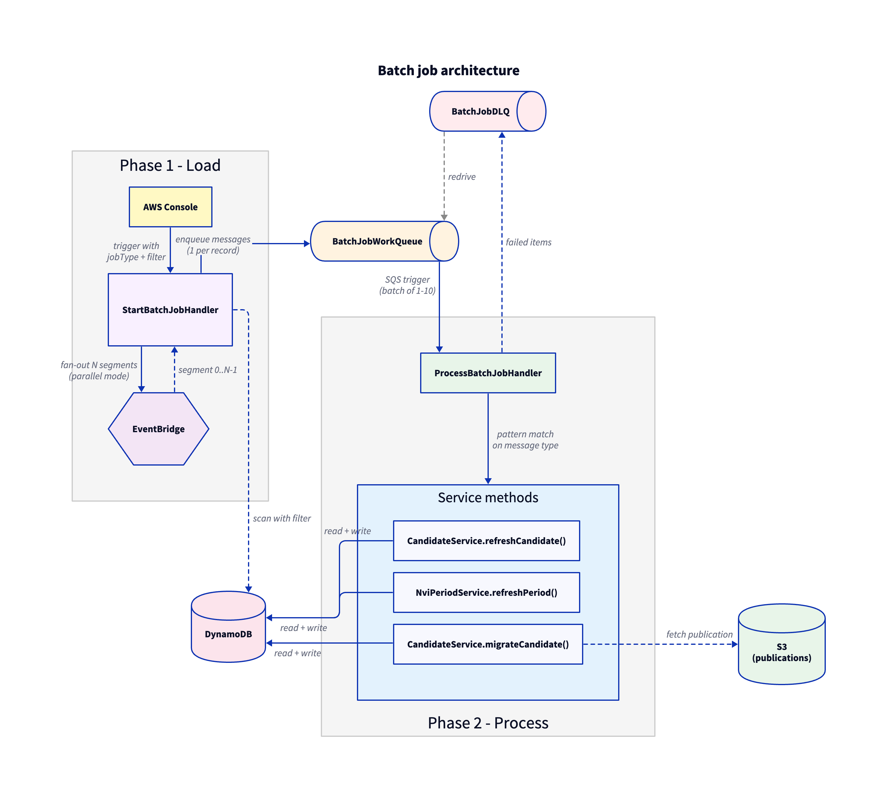

_# NP-50064: Queue-based batch job with optimistic locking

## Problem statement

The current `BatchScanRecoveryHandler` and `EventBasedBatchScanHandler` bypass optimistic locking by using low-level DynamoDB batch write operations via `BatchScanUtil.migrateAndUpdateVersion()`. This can cause race conditions when concurrent writes occur, as the entire object is PUT without transaction protection.

## Solution

Replace the existing batch scan infrastructure with a two-phase queue-based system:

**Phase 1 - Load work queue**: Trigger `StartBatchJobHandler` manually via AWS Console with a job type and filter (e.g., reporting year). The handler scans DynamoDB, applies the filter, and enqueues one message per record onto `BatchJobWorkQueue`. For large result sets, it self-invokes via EventBridge to handle pagination.

**Phase 2 - Process items**: `ProcessBatchJobHandler` is automatically triggered by SQS for each message. It uses safe transactional service methods (`CandidateService`, `NviPeriodService`) with optimistic locking. Failed items go to `BatchJobDLQ` and can be redriven.

This ensures all batch operations go through the same optimistic locking mechanism as regular operations, eliminating the race conditions in the current implementation.

### Architecture diagram



### Key design decisions

Requirements:

1. **Re-use**: Base the mechanics of the system on the new [BatchJob](https://sikt.atlassian.net/wiki/spaces/NVAP/pages/4015522570/Queue+based+dynamodb+BatchJob) setup in publication-api
2. **Standalone**: Implement the system separately from the existing BatchScan and leave existing code in place for now
3. **Filtering**: Support filtering scans by year and record type
4. **Single system**: One system should handle both data model migration and reindexing needs

Planned changes:

1. **Safe methods only**: `ProcessBatchJobHandler` uses transactional service methods with optimistic locking. New service methods will be added as needed.
2. **Two job categories**:
    - **Refresh**: Read from DB, write back. Triggers "on read" migrations (data restructuring) and OpenSearch reindex. Fast, DB-only.
    - **Migrate**: Read from DB + fetch original publication from S3, enrich with missing data, write back. Slower, requires external I/O.
3. **Migration handled by service layer**: The batch job handler is simple - it just dispatches to service methods. All migration logic (including S3 fetching) should be done in the service layer.
4. **DLQ redrive**: Failed items go to DLQ and can be reprocessed using AWS SQS redrive feature (no separate recovery handler needed).
5. **Adjustable throughput**: Processing speed can be controlled by adjusting the SQS trigger configuration on `ProcessBatchJobHandler` (batch size 1-10) and Lambda reserved concurrency. This allows fast bulk processing or slower background processing depending on needs.

---

## Sub-tasks

### Sub-task 1: Define message contracts

**Description**: Create the data models for batch job operations:
1. `StartBatchJobRequest` - Input to `StartBatchJobHandler` (triggered via AWS Console)
2. `BatchJobMessage` - Sealed interface for queue messages (one per record to process)

The `BatchJobMessage` types are minimal - they only contain enough information to identify the record, since filtering happens at queue-loading time.

**Module**: `event-handlers`

**Implementation**:

1. Create package `no.sikt.nva.nvi.events.batch.model`

2. Create sealed interface with Jackson polymorphic serialization:
   ```java
   @JsonTypeInfo(use = JsonTypeInfo.Id.NAME, property = "type")
   @JsonSubTypes({
       @JsonSubTypes.Type(value = RefreshCandidateMessage.class, name = "REFRESH_CANDIDATE"),
       @JsonSubTypes.Type(value = MigrateCandidateMessage.class, name = "MIGRATE_CANDIDATE"),
       @JsonSubTypes.Type(value = RefreshPeriodMessage.class, name = "REFRESH_PERIOD")
   })
   public sealed interface BatchJobMessage
       permits RefreshCandidateMessage, MigrateCandidateMessage, RefreshPeriodMessage {}
   ```

3. Create message implementations (minimal - just identifiers):
   ```java
   public record RefreshCandidateMessage(UUID identifier) implements BatchJobMessage {}
   public record MigrateCandidateMessage(UUID identifier) implements BatchJobMessage {}
   public record RefreshPeriodMessage(String year) implements BatchJobMessage {}
   ```

4. Create `StartBatchJobRequest` for triggering batch jobs:
   ```java
   public enum BatchJobType {
       REFRESH_CANDIDATES,
       MIGRATE_CANDIDATES,
       REFRESH_PERIODS
   }

   public record ReportingYearFilter(
       List<String> reportingYears  // Empty means all years (normalized from null)
   ) {}

   public record StartBatchJobRequest(
       BatchJobType jobType,
       ReportingYearFilter filter,
       Integer maxItemsPerSegment,  // Optional per-segment limit - null means no limit
       Integer parallelSegments,    // Number of parallel segments - null defaults to 10
       PaginationState paginationState  // null on initial trigger, set on self-invoke
   ) {
       public static final int DEFAULT_PARALLEL_SEGMENTS = 10;
   }
   ```

5. Create `PaginationState` as a sealed interface with two implementations for different scan strategies:
   ```java
   @JsonTypeInfo(use = JsonTypeInfo.Id.NAME, property = "type")
   @JsonSubTypes({
       @JsonSubTypes.Type(value = TableScanState.class, name = "TABLE_SCAN"),
       @JsonSubTypes.Type(value = YearQueryState.class, name = "YEAR_QUERY")
   })
   public sealed interface PaginationState
       permits TableScanState, YearQueryState {

       Map<String, String> lastEvaluatedKey();
       int itemsEnqueued();
       PaginationState withNextPage(Map<String, String> newLastEvaluatedKey, int additionalItems);
   }

   // Used for parallel table scans (no year filter)
   public record TableScanState(
       int segment,
       int totalSegments,
       Map<String, String> lastEvaluatedKey,
       int itemsEnqueued
   ) implements PaginationState { ... }

   // Used for GSI queries by year (with year filter)
   public record YearQueryState(
       List<String> remainingYears,  // Years left to process (shrinks as we complete each year)
       Map<String, String> lastEvaluatedKey,
       int itemsEnqueued
   ) implements PaginationState {
       public String currentYear() { return remainingYears.getFirst(); }
       public boolean hasMoreYears() { return remainingYears.size() > 1; }
       public YearQueryState withNextYear() { return new YearQueryState(remainingYears.subList(1, remainingYears.size()), null, itemsEnqueued); }
   }
   ```

   **Rationale**: The two scan strategies (parallel table scan vs. GSI query by year) have different state requirements. Using a sealed interface:
   - Eliminates unused fields (e.g., `segment`/`totalSegments` are meaningless for year queries)
   - Makes the handler logic clearer with pattern matching
   - Enforces valid state combinations at compile time

6. Write tests for JSON serialization/deserialization (including polymorphic round-trip for BatchJobMessage and PaginationState)

**Job type semantics**:
- `REFRESH_CANDIDATES`: Read candidate from DB, write back. Triggers "on read" migrations and OpenSearch reindex.
- `MIGRATE_CANDIDATES`: Read candidate from DB + fetch original publication from S3, enrich with missing data, write back.
- `REFRESH_PERIODS`: Read period from DB, write back.

**Acceptance Criteria**:
- `BatchJobMessage` types serialize to JSON with type discriminator and deserialize back correctly
- `StartBatchJobRequest` serializes/deserializes correctly from AWS Console JSON input
- Each message type has only the fields it needs (just identifier)
- Tests pass

---

### Sub-task 2: Add service methods for batch operations

**Description**: Refactor `CandidateService` and add equivalent method to `NviPeriodService` to support the batch job operations. The existing `updateCandidate(Candidate)` method is only used by one caller that first fetches, then updates - we can simplify this to a single `refreshCandidate(UUID)` method.

**Module**: `nvi-commons`

**Implementation** (TDD):

1. Refactor `CandidateService`:
   - Rename/refactor `updateCandidate(Candidate)` to `refreshCandidate(UUID identifier)`
   - The new method fetches the candidate by identifier and writes it back (triggering "on read" migrations)
   - Update the single existing caller to use the new method
   - Add `migrateCandidate(UUID identifier)` - fetches from DB + S3, enriches, writes back

   ```java
   public void refreshCandidate(UUID identifier) {
       var candidate = getCandidateByIdentifier(identifier);
       updateCandidate(candidate);  // Internal method with transactional write
   }

   public void migrateCandidate(UUID identifier) {
       // Fetch candidate from DB
       // Fetch original publication from S3
       // Enrich candidate with missing data
       // Write back with transactional update
   }
   ```

2. Add to `NviPeriodService`:
   ```java
   public void refreshPeriod(String year) {
       var period = getByPublishingYear(year);
       update(period);  // Internal method with transactional write
   }
   ```

**Tests**:
- `refreshCandidate()` fetches and writes back candidate
- `migrateCandidate()` fetches from DB and S3, enriches, writes back
- `refreshPeriod()` fetches and writes back period
- All methods use transactional writes with optimistic locking
- Existing caller of old `updateCandidate()` still works after refactor

**Acceptance Criteria**:
- `CandidateService.refreshCandidate(UUID)` implemented and tested
- `CandidateService.migrateCandidate(UUID)` implemented and tested
- `NviPeriodService.refreshPeriod(String)` implemented and tested
- Existing functionality not broken
- All tests pass

---

### Sub-task 3: Create infrastructure

**Description**: Set up all CloudFormation/SAM infrastructure and handler skeletons. This includes SQS queues, Lambda definitions, IAM permissions, and minimal handler classes that compile but don't have full logic yet.

**Module**: `template.yaml`, `event-handlers`

**Implementation**:

1. Add SQS work queue:
   ```yaml
   BatchJobWorkQueue:
     Type: AWS::SQS::Queue
     Properties:
       VisibilityTimeout: 300
       MessageRetentionPeriod: 86400  # 1 day
       RedrivePolicy:
         deadLetterTargetArn: !GetAtt BatchJobDLQ.Arn
         maxReceiveCount: 3
   ```

2. Add SQS dead letter queue:
   ```yaml
   BatchJobDLQ:
     Type: AWS::SQS::Queue
     Properties:
       MessageRetentionPeriod: 1209600  # 14 days
   ```

3. Add `StartBatchJobHandler` Lambda definition:
   ```yaml
   StartBatchJobHandler:
     Type: AWS::Serverless::Function
     Properties:
       CodeUri: event-handlers
       Handler: no.sikt.nva.nvi.events.batch.StartBatchJobHandler::handleRequest
       Role: !GetAtt NvaNviRole.Arn
       Timeout: 900
       Environment:
         Variables:
           BATCH_JOB_QUEUE_URL: !Ref BatchJobWorkQueue
           EVENT_BUS_NAME: !GetAtt InternalBus.Name
           PROCESSING_ENABLED: "true"
   ```

4. Add `ProcessBatchJobHandler` Lambda definition with SQS trigger:
   ```yaml
   ProcessBatchJobHandler:
     Type: AWS::Serverless::Function
     Properties:
       CodeUri: event-handlers
       Handler: no.sikt.nva.nvi.events.batch.ProcessBatchJobHandler::handleRequest
       Role: !GetAtt NvaNviRole.Arn
       Timeout: 60
       MemorySize: 1024
       Environment:
         Variables:
           NVI_TABLE_NAME: !Ref NviTable
       Events:
         SQSEvent:
           Type: SQS
           Properties:
             Queue: !GetAtt BatchJobWorkQueue.Arn
             BatchSize: 5
             MaximumBatchingWindowInSeconds: 0
             FunctionResponseTypes:
               - ReportBatchItemFailures
   ```

5. Add queue ARNs to `NvaNviRole` IAM policy (SQS permissions section)

6. Create handler skeleton classes (compile but don't implement full logic):
   ```java
   // StartBatchJobHandler.java
   public class StartBatchJobHandler extends EventHandler<StartBatchJobRequest, Void> {
       @Override
       protected Void processInput(StartBatchJobRequest input, RequestInfo requestInfo, Context context) {
           throw new UnsupportedOperationException("Not yet implemented");
       }
   }

   // ProcessBatchJobHandler.java
   public class ProcessBatchJobHandler implements RequestHandler<SQSEvent, SQSBatchResponse> {
       @Override
       public SQSBatchResponse handleRequest(SQSEvent event, Context context) {
           throw new UnsupportedOperationException("Not yet implemented");
       }
   }
   ```

**Acceptance Criteria**:
- Queues created on deployment with redrive policy (3 attempts before DLQ)
- IAM permissions allow send/receive/delete on queues
- Both handlers deploy successfully (skeleton classes compile)
- SQS trigger configured for `ProcessBatchJobHandler`
- Infrastructure can be tested with SAM local or deployed to dev

---

### Sub-task 4: Implement `StartBatchJobHandler`

**Description**: Implement the logic for scanning the database based on job type and filter, then enqueuing work items. Self-invokes via EventBridge for pagination.

**Module**: `event-handlers`

**Input format** (sent via AWS Console):

Full reprocess (all items, 10 parallel segments):
```json
{
  "jobType": "REFRESH_CANDIDATES",
  "filter": {
    "reportingYears": ["2024", "2025"]
  }
}
```

Testing with exact count (single segment, limited items):
```json
{
  "jobType": "REFRESH_CANDIDATES",
  "filter": {
    "reportingYears": ["2024"]
  },
  "parallelSegments": 1,
  "maxItemsPerSegment": 10
}
```

Custom parallelism with per-segment limits (~2000 total items across 20 segments):
```json
{
  "jobType": "REFRESH_CANDIDATES",
  "parallelSegments": 20,
  "maxItemsPerSegment": 100
}
```

Note: `paginationState` is not provided by the user - it's only used internally when the handler self-invokes.

**Supported job types**:
- `REFRESH_CANDIDATES` - Creates `RefreshCandidateMessage` for each candidate
- `MIGRATE_CANDIDATES` - Creates `MigrateCandidateMessage` for each candidate
- `REFRESH_PERIODS` - Creates `RefreshPeriodMessage` for each period

**Implementation** (TDD):

1. Implement `StartBatchJobHandler`:
   - Uses `StartBatchJobRequest`, `BatchJobType`, `ReportingYearFilter`, and `PaginationState` (sealed interface) defined in sub-task 1
   - Check `PROCESSING_ENABLED` environment variable at start
   - Based on `jobType`, determine which entities to scan and which message type to create

   **Initial invocation** (when `paginationState` is null):
   - If `filter.reportingYears` is specified: create single `YearQueryState` (Query operations don't support parallel segments)
   - Otherwise: create N `TableScanState` instances, one per segment (using `parallelSegments` or default 10)
   - Fire EventBridge events to self-invoke with the pagination state(s)

   **Segment processing** (when `paginationState` is set):
   ```java
   switch (paginationState) {
       case TableScanState state -> processTableScan(state);
       case YearQueryState state -> processYearQuery(state);
   }
   ```

   **TableScanState processing**:
   - Scan base table with `.withSegment(n).withTotalSegments(total)`
   - Create appropriate `BatchJobMessage` for each entity
   - Batch-send messages to queue (10 at a time)
   - If more pages exist: self-invoke with `state.withNextPage(lastKey, count)`
   - Otherwise: segment complete

   **YearQueryState processing**:
   - Query GSI by `state.currentYear()`
   - Create appropriate `BatchJobMessage` for each entity
   - Batch-send messages to queue (10 at a time)
   - If more pages for current year: self-invoke with `state.withNextPage(lastKey, count)`
   - Else if `state.hasMoreYears()`: self-invoke with `state.withNextYear()`
   - Otherwise: all years complete

   **Common**:
   - Track `itemsEnqueued` in the state
   - If `maxItemsPerSegment` set and reached: stop

**Tests**:
- Handler creates `RefreshCandidateMessage` for `REFRESH_CANDIDATES` job type
- Handler creates `MigrateCandidateMessage` for `MIGRATE_CANDIDATES` job type
- Handler creates `RefreshPeriodMessage` for `REFRESH_PERIODS` job type
- No year filter: initial invocation creates N `TableScanState` events (parallel segments)
- No year filter: `TableScanState` processing uses `.withSegment(n).withTotalSegments(total)`
- Year filter: initial invocation creates single `YearQueryState` event
- Year filter: `YearQueryState` processing iterates through years via `withNextYear()`
- Segment processing: stops after reaching `maxItemsPerSegment` limit
- Segment processing: self-invokes with updated cursor until complete
- Handler aborts when `PROCESSING_ENABLED=false`
- Handler handles empty scan results gracefully

**Acceptance Criteria**:
- Supports all three job types
- Full table scan: uses `TableScanState` with parallel segments (default 10)
- Year-filtered scan: uses `YearQueryState` with GSI Query (iterates through years sequentially)
- Allows custom segment count via `parallelSegments` parameter
- Respects `maxItemsPerSegment` limit per segment when specified
- Enqueues correctly formatted messages with type discriminator
- Each segment/year-query paginates independently via self-invocation
- Can be stopped via environment variable
- All tests pass

---

### Sub-task 5: Implement `ProcessBatchJobHandler`

**Description**: Implement the logic for processing individual work items using the safe transactional methods in `CandidateService` and `NviPeriodService`.

**Module**: `event-handlers`

**Implementation** (TDD):

1. Implement `ProcessBatchJobHandler`:
   ```java
   @Override
   public SQSBatchResponse handleRequest(SQSEvent event, Context context) {
       var failures = new ArrayList<BatchItemFailure>();

       for (var record : event.getRecords()) {
           try {
               var message = parseMessage(record.getBody());
               processMessage(message);
           } catch (Exception e) {
               logger.error("Failed to process message: {}", record.getMessageId(), e);
               failures.add(new BatchItemFailure(record.getMessageId()));
           }
       }

       return new SQSBatchResponse(failures);
   }

   private void processMessage(BatchJobMessage message) {
       switch (message) {
           case RefreshCandidateMessage(var identifier) -> {
               candidateService.refreshCandidate(identifier);
           }
           case MigrateCandidateMessage(var identifier) -> {
               candidateService.migrateCandidate(identifier);
           }
           case RefreshPeriodMessage(var year) -> {
               nviPeriodService.refreshPeriod(year);
           }
       }
   }
   ```

**Tests**:
- `RefreshCandidateMessage`: calls `candidateService.refreshCandidate()`
- `MigrateCandidateMessage`: calls `candidateService.migrateCandidate()`
- `RefreshPeriodMessage`: calls `nviPeriodService.refreshPeriod()`
- Returns failed message IDs in `SQSBatchResponse.batchItemFailures()`
- Handles missing candidate gracefully (logs error, reports failure)
- Handles missing period gracefully (logs error, reports failure)
- Partial batch failure: successful items not reprocessed

**Acceptance Criteria**:
- Processes all three message types correctly
- Uses transactional service methods for all operations
- Failed items reported correctly for DLQ routing
- Successful items in partial failure batch not reprocessed
- All tests pass

---

### Sub-task 6: Update documentation and deprecate old handlers

**Description**: Document operational procedures and mark old batch scan code as deprecated.

**Module**: Documentation, `event-handlers`

**Implementation**:

1. Update `CLAUDE.md` operational tasks section:
   ```markdown
   ### Batch job operations

   Trigger `StartBatchJobHandler` via AWS Console (Lambda → Test) with one of these payloads:

   **Refresh candidates** (reindex, trigger "on read" migrations):
   {
     "jobType": "REFRESH_CANDIDATES",
     "filter": {
       "reportingYears": ["2024", "2025"]
     }
   }

   **Migrate candidates** (fetch from S3, enrich with missing data):
   {
     "jobType": "MIGRATE_CANDIDATES",
     "filter": {
       "reportingYears": ["2024"]
     }
   }

   **Refresh periods**:
   {
     "jobType": "REFRESH_PERIODS",
     "filter": {
       "reportingYears": ["2024", "2025"]
     }
   }

   Note: Omit `filter` or set `reportingYears: []` to process all.

   ### Adjusting batch processing throughput

   Edit the SQS trigger on `ProcessBatchJobHandler` in AWS Console:
   - Lambda → ProcessBatchJobHandler → Configuration → Triggers
   - Edit SQS trigger:
     - BatchSize: 1-10 (items per Lambda invocation)
   - For concurrency control, adjust Lambda reserved concurrency

   ### Emergency stop

   To stop loading new items:
   - Set `PROCESSING_ENABLED=false` on `StartBatchJobHandler`

   To stop processing:
   - Disable SQS trigger on `ProcessBatchJobHandler`
   - Optionally purge `BatchJobWorkQueue` if items should be discarded

   ### DLQ recovery

   Failed items accumulate in `BatchJobDLQ`. To reprocess:
   1. AWS Console → SQS → BatchJobDLQ
   2. Click "Start DLQ redrive"
   3. Select "Redrive to source queue"
   4. Monitor ProcessBatchJobHandler for processing
   ```

2. Add `@Deprecated` annotations with migration notes:
   ```java
   /**
    * @deprecated Use {@link StartBatchJobHandler} and {@link ProcessBatchJobHandler} instead.
    * This handler bypasses optimistic locking and can cause race conditions.
    * Scheduled for removal in a future release.
    */
   @Deprecated(forRemoval = true)
   public class BatchScanRecoveryHandler { ... }
   ```

   Apply to:
   - `BatchScanRecoveryHandler`
   - `EventBasedBatchScanHandler`
   - `BatchScanStartHandler`

**Acceptance Criteria**:
- CLAUDE.md contains operational instructions
- Old handlers marked `@Deprecated` with clear migration path
- No removal of old handlers (keep for rollback capability)

---

## Future considerations

1. **Remove deprecated handlers**: After validation in production, create follow-up task to remove old batch scan code.

2. **Additional job types**: The sealed interface pattern makes it easy to add new job types (e.g., `MigratePeriodMessage`) by adding new implementations to `BatchJobMessage`.

3. **Extended filtering**: The `ReportingYearFilter` can be extended with additional fields (e.g., `institutionId`, `status`) for more targeted batch operations.

4. **Metrics and alerting**: Consider adding CloudWatch metrics for queue depth, processing rate, and DLQ accumulation.

5. **CLI tooling**: Similar to `aws-nva-cli` for publication-api, a tool to queue specific candidate IDs for reprocessing could be useful.

6. **Year-based parallelism for GSI queries**: The current `YearQueryState` processes years sequentially. For large datasets, could fire N parallel Lambdas (one per year) for better throughput. This would be a simple enhancement: in the initial invocation, create one `YearQueryState` per year instead of one with all years.
